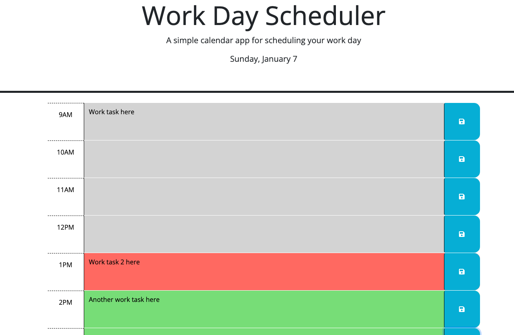

# Work Day Scheduler

## Description

This project was created to create an online work day scheduler with input and time tracker.

## Installation

Installation is not required. The webpage is accessible from any web browser application.

## Usage

To use this service simply navigate to the website address below.

https://ahelmin.github.io/Work-Day-Scheduler/

To use the word day scheduler, simply put your task in the text box in which your task is to be completed as seen in the screenshot below. The current time will be tracked and updated as you refresh the page. Grey boxes mean that it is an old task overdue, the orange means that is the current hour and the task is due, and the green color means that it is a future event.

After your task has been entered into the text box click on the save button as seen below in the image. You will see a message under the date at the top that the task was saved. This task will be saved even if you refresh your browser window. To erase a task delete the text in the hour block and save the empty block and it will be gone until you save another task in that block.

## Credits

Thanks goes to the University of Minnesota and Edx Bootcamp for providing the assistance needed to complete this project which includes the starter HTML code, the completed CSS code, and plenty of hints for coding the JavaScript.

## License

MIT License

Copyright (c) 2023 helm0127

Permission is hereby granted, free of charge, to any person obtaining a copy
of this software and associated documentation files (the "Software"), to deal
in the Software without restriction, including without limitation the rights
to use, copy, modify, merge, publish, distribute, sublicense, and/or sell
copies of the Software, and to permit persons to whom the Software is
furnished to do so, subject to the following conditions:

The above copyright notice and this permission notice shall be included in all
copies or substantial portions of the Software.

THE SOFTWARE IS PROVIDED "AS IS", WITHOUT WARRANTY OF ANY KIND, EXPRESS OR
IMPLIED, INCLUDING BUT NOT LIMITED TO THE WARRANTIES OF MERCHANTABILITY,
FITNESS FOR A PARTICULAR PURPOSE AND NONINFRINGEMENT. IN NO EVENT SHALL THE
AUTHORS OR COPYRIGHT HOLDERS BE LIABLE FOR ANY CLAIM, DAMAGES OR OTHER
LIABILITY, WHETHER IN AN ACTION OF CONTRACT, TORT OR OTHERWISE, ARISING FROM,
OUT OF OR IN CONNECTION WITH THE SOFTWARE OR THE USE OR OTHER DEALINGS IN THE
SOFTWARE.
